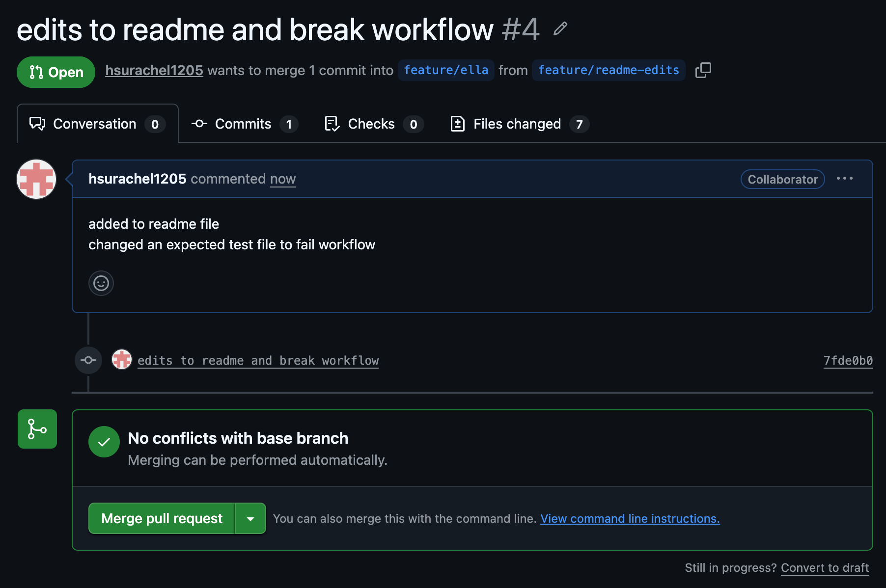

Input/Output Contract

Input:
    Please enter a non-negative, whole-number temperature value: 80
    Is the temperature in C or F?: F

Output:
    Temperature in C: 26

Test scenarios:
    Test 1: 80 F converts to 26 F
    Test 2: -3 C results in an error "Invalid input. Input must be non-negative and a whole number."
    Test 3: 0 C converts to 32 F
    Test 4: 32 F converts to 0 C
    Test 5: 70 A results in an error "Invalid input. Conversion not possible."

Build and test commands:
Build
    git clone https://github.com/YOUR-USERNAME/week02-class-project.git
    cd week02-class-project
    git switch -c feature/implementation
    mkdir -p src tests .github/workflows
    printf "build/\n" > .gitignore

Test - test.sh
    #!/usr/bin/env bash
    set -eu
    mkdir -p build
    g++ -std=c++17 -Wall -Wextra -pedantic src/main.cpp -o build/app
    ./build/app < tests/input1.txt > build/actual1.txt
    diff -u tests/expected1.txt build/actual1.txt
    ./build/app < tests/input2.txt > build/actual2.txt
    diff -u tests/expected2.txt build/actual2.txt
    echo "All acceptance tests passed"
bash test.sh to run

Limitations:
Only accepts non-negative whole number inputs. Uses integer division, so it is very imprecise. Rounds results down instead of 
producing results of type double.

Pseudocode:
Input: temperature value, C or F
Output: temperature converted from C to F or from F to C

START
    Set temp variable as an int type
    Set unit variable as a char type
    Set newtemp variable as an int
    Ask the user to enter a temperature value (positive, whole number)
    Input temp value as inputted user temp value
    Ask the user to enter whether the temperature is in C or F
    Input user value for unit into unit variable value
 
    If temp >= 0
        If unit inputted is C
            newtemp variable = (temp value * 9 / 5) + 32
            Output “Temperature in F: (newtemp value)”
        Else if the unit inputted is F
            newtemp variable = (temp value - 32) * 5 / 9
            Output “Temperature in C: (newtemp value)”
        Else
            Produce an error message output
    Else
        Produce an error message output
END

Output screenshots

Result of running bash test.sh

Reviewed pull request example

Workflow failure and fix results

Video demo
*see canvas assignment attachment