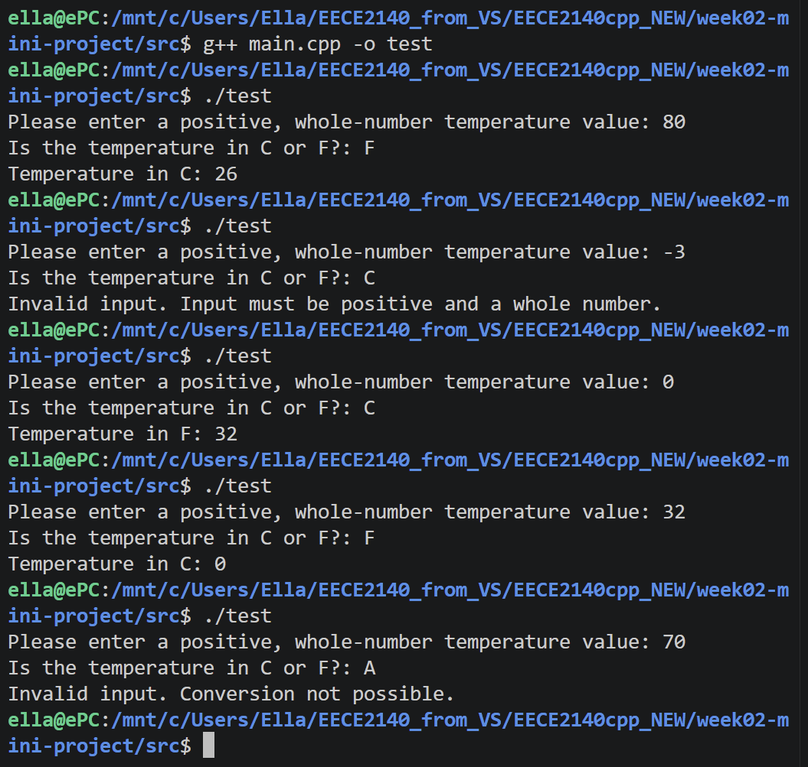

Input/Output Contract

Input:
    Please enter a positive, whole-number temperature value: 80
    Is the temperature in C or F?: F

Output:
    Temperature in C: 26

Test scenarios:
    Test 1: 80 F converts to 26 F
    Test 2: -3 C results in an error "Invalid input. Input must be positive and a whole number."
    Test 3: 0 C converts to 32 F
    Test 4: 32 F converts to 0 C
    Test 5: 70 A results in an error "Invalid input. Conversion not possible."

Pseudocode:
Input: temperature value, C or F
Output: temperature converted from C to F or from F to C

START
    Set temp variable as an int type
    Set unit variable as a char type
    Set newtemp variable as an int
    Ask the user to enter a temperature value (positive, whole number)
    Input temp value as inputted user temp value
    Ask the user to enter whether the temperature is in C or F
    Input user value for unit into unit variable value
 
    If temp > 0
        If unit inputted is C
            newtemp variable = (temp value * 9 / 5) + 32
            Output “Temperature in F: (newtemp value)”
        Else if the unit inputted is F
            newtemp variable = (temp value - 32) * 5 / 9
            Output “Temperature in C: (newtemp value)”
        Else
            Produce an error message output
    Else if temp is 0 and unit is C
        Output “Temperature in F: 32”
    Else if temp is 32 and unit is F
        Output “Temperature in C: 0”
    Else
        Produce an error message output
END

Output screenshots

Result of running bash test.sh

Reviewed pull request example

